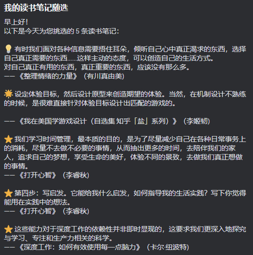

# 从微信读书中抽划线或笔记发送到 Discord

每天从微信读书中抽出 5 条划线或笔记，通过 Webhook 发送到 Discord 中。

## 感谢

灵感出自 **Readwise** 的**每日邮件回顾**。

代码改自 [https://github.com/malinkang/weread2notion](https://github.com/malinkang/weread2notion)

## 使用

1. Fork 这个工程
2. 获取微信读书的 API Key
    * 打开 [https://weread.qq.com/r/weread-skills](https://weread.qq.com/r/weread-skills)（或在微信读书 App 内的「微信读书 Skill」页面）
    * 登录微信读书账号，生成并复制 API Key（`wrk-` 开头，长期有效，无需像 Cookie 一样反复更新）
3. 获取 Discord 的 Webhook URL
    * 打开要发送消息的 Discord 服务器或频道（需要管理员或拥有者权限）
    * 打开服务器设置或频道设置
    * 在服务器或频道设置页面中，依次点「整合」->「Webhook」->「新 Webhook」->「新创建出来的 Webhook」->「复制 Webhook URL」
4. 在 GitHub 的 Secrets 中添加变量
    * 打开第一步 Fork 的工程，点击「Settings」->「Secrets and variables」->「New repository secret」
    * 添加以下变量
        * WEREAD_API_KEY
        * DISCORD_WEBHOOK_URL

## 预览图

---

